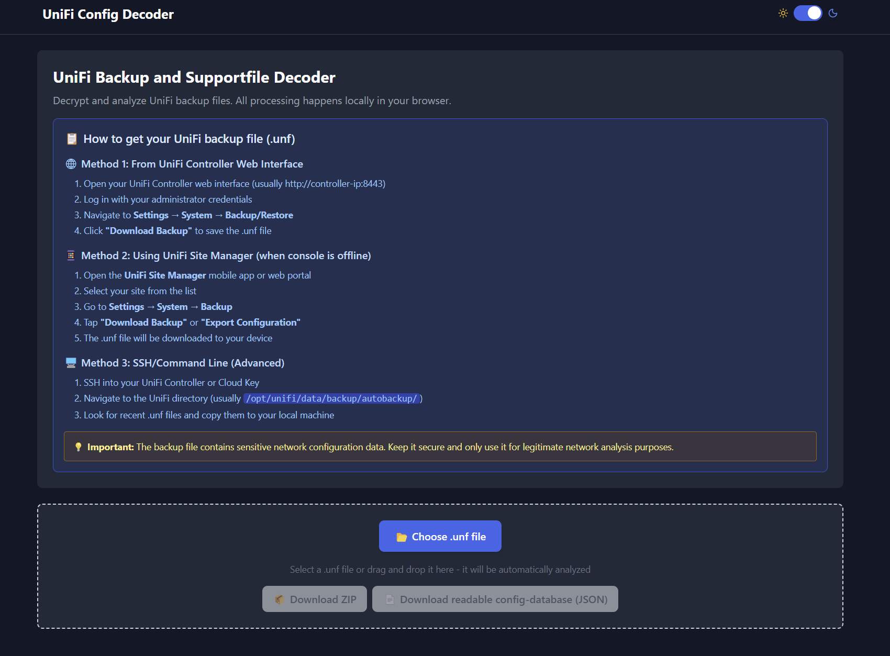
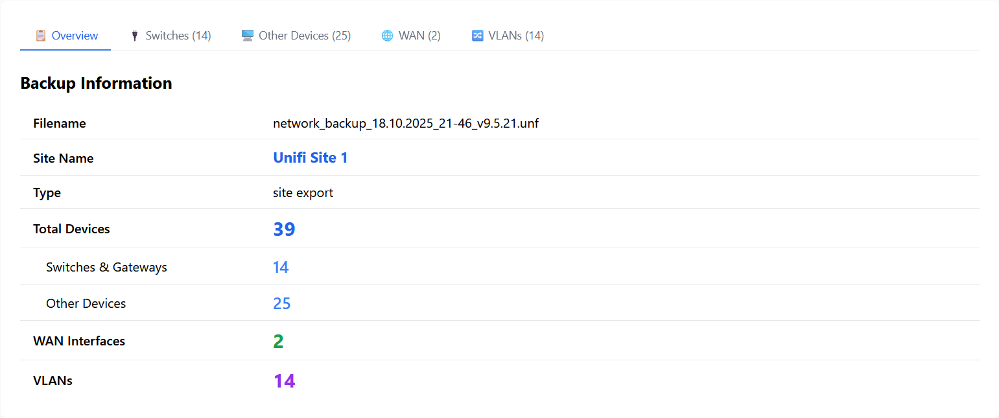
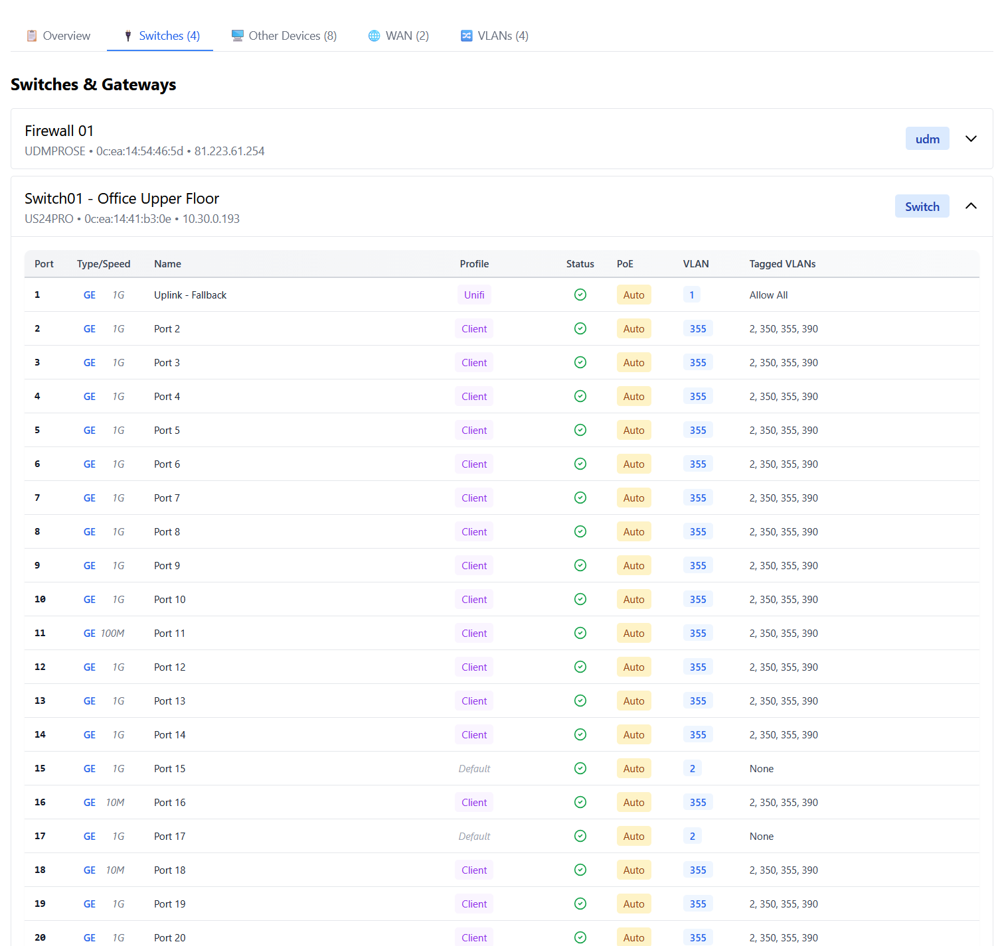
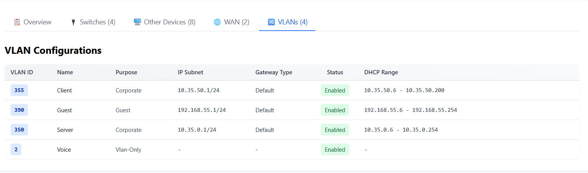

# Unifi Config Decoder

[](https://github.com/markush97/Unifi-Config-Decoder/actions/workflows/release.yml)
[](https://github.com/markush97/Unifi-Config-Decoder/releases/latest)
[](https://github.com/markush97/Unifi-Config-Decoder/releases)
[](https://github.com/markush97/Unifi-Config-Decoder/releases/latest)
[](https://github.com/markush97/unifi-config-decoder/pkgs/container/unifi-config-decoder)
[](LICENSE)

> **📦 Download the latest build**: Get the ready-to-use application from the [latest release](https://github.com/markush97/Unifi-Config-Decoder/releases/latest)

I struggled for some time to have good disaster recovery features in place for Ubiquiti UniFi setups. I wanted a solution that allows me to easily find useful debugging information (for example VLANs, Gateway IPs and configured Switch Ports) without needing to have a working/reachable UniFi controller with the current config.

I looked around on the web and did not find anything that suited my needs so I just built it myself.

You can try out the application immediately at the [**Demo**](https://unifi.hilabs.eu) - it's completely safe as all processing happens locally in your browser without uploading any data to external servers.

## Features

- 🔍 **Decrypt and analyze** UniFi backup files (.unf)
- 📊 **Visual dashboard** with device overview, VLANs, switches, and WAN configuration
- 🏠 **Runs locally** - all processing happens in your browser, no data leaves your machine
- 📱 **Responsive design** - works on desktop and mobile devices
- 🌙 **Dark/Light theme** support
- 📦 **Multiple export formats** - JSON database dumps and ZIP archives
- 🏗️ **Self-hostable** - Just deploy using Docker or put static webpage onto webserver
- 📴 **Run offline** - Pre-bundled for many distributions (as .deb, .exe etc.)

## Screenshots

### Landing Page



_Upload your UniFi backup file and get started with the analysis_

### Overview Dashboard



_Get a comprehensive overview of your UniFi configuration_

### Switch Configuration



_Detailed view of switch ports and their configurations_

### VLAN Analysis



_Analyze your network segmentation and VLAN setup_

## Usage

### Desktop Application (Native)

This way of installation allows having file-name-associations for .unf files so you can just doubleclick them to open.

Download the native desktop application for your operating system from [GitHub Releases](https://github.com/markush97/Unifi-Config-Decoder/releases/latest):

**🐧 Linux:**

- **`.deb`** - For Ubuntu, Debian, and derivatives (double-click to install)
- **`.AppImage`** - Portable application (make executable and run)
- **`.tar.gz`** - Archive for manual installation

**🪟 Windows:**

The Windows app is not signed yet. If somebody wants to sponsor the Code-Signing Certificate feel free to reach out! Would really appreciate it!

- **`.exe`** - Windows app

**🍎 macOS:**

- **`.dmg`** - Disk image for macOS

### 🐳 Docker (Recommended for Servers)

Run the application using Docker with multi-architecture support:

```bash
# Latest version
docker run -p 3000:80 ghcr.io/markush97/unifi-config-decoder:latest
```

#### Docker Compose Example

Create a `docker-compose.yml` file:

```yaml
services:
  unifi-decoder:
    image: ghcr.io/markush97/unifi-config-decoder:latest
    container_name: unifi-decoder
    ports:
      - '3000:80'
    restart: unless-stopped
```

Then run:

```bash
docker-compose up -d
```

Then open your browser and navigate to `http://localhost:3000` (or your chosen port).

**Supported architectures:**

- `linux/amd64` (x86_64)
- `linux/arm64` (ARM64/AArch64)
- `linux/arm/v7` (ARM32v7)

### 📦 Static HTML (Portable)

1. **Download** the latest release ZIP from [GitHub Releases](https://github.com/markush97/Unifi-Config-Decoder/releases/latest)
2. **Extract** the `unifi-decoder-vX.X.X.zip` file to a folder
3. **Open** the `index.html` file in your web browser
4. **Upload** your `.unf` backup file and start analyzing!

### 🌐 Online Version

Just visit https://unifi.hilabs.eu for easy usage without any setup required. Still as safe as the offline version, since all calculations are always done locally in your browser without uploading any data.

## How to Use

1. **Get your UniFi backup file** (`.unf`):
   - Export from UniFi Controller: Settings → System → Backup/Restore → Download Backup
2. **Open the application**
3. **Upload your `.unf` file**:
   - Click "📂 Choose .unf file" or drag and drop
   - The file will be automatically decrypted and analyzed
4. **Explore your configuration**:
   - **Overview**: General information and statistics
   - **Devices**: All UniFi devices in your network
   - **Switches**: Port configurations and VLANs
   - **VLANs**: Network segmentation details
   - **WAN**: Internet connection settings
5. **Export results**:
   - **📦 Download ZIP**: Get processed files as decrypted archive
   - **📄 Download JSON**: Get readable config database

## Contribution

Feel free to open issues or contribute to the project. I cannot promise any quick changes but I am open to criticism and feedback.
